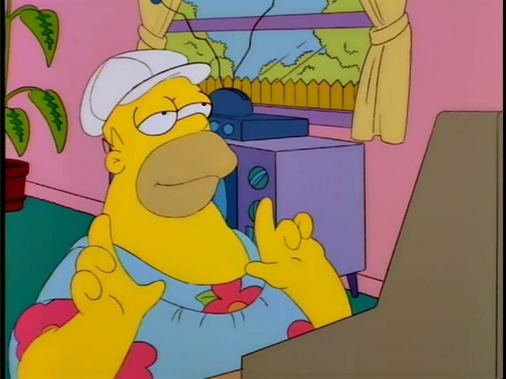

# 💽 PHONK/TRAP PROGRAMMING TRAXX

<h1 align="center">
  
</h1>

<h2 align="center">
  <b>TRAPPIN AT ＳＴΛＮＤ－ＵＰ</b>
</h2>

  

  

## Overview

A phonk spotify playlist for programmers. For the most part, tracks are instrumental with repetitive vocals.

## Track Submissions

To submit a track, open a feature request issue. All tracks will be reviewed.
